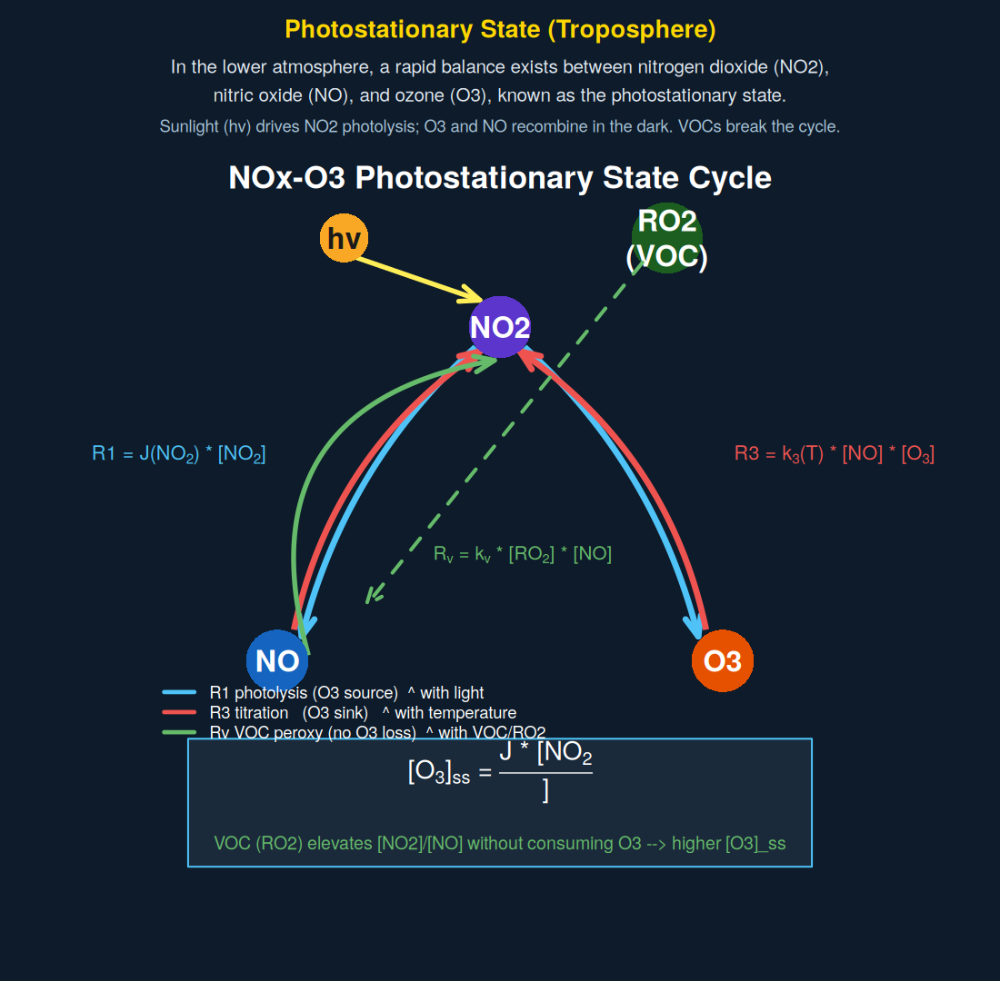

```{r setup, include=FALSE}
knitr::opts_chunk$set(echo = FALSE, warning = FALSE, message = FALSE)
```

```{css, echo=FALSE}
body { font-family: Georgia, serif; font-size: 16px; line-height: 1.7; }
h1, h2, h3 { font-family: "Helvetica Neue", sans-serif; }
.equation-box {
  background: #f0f4f8;
  border-left: 4px solid #2c7be5;
  padding: 1em 1.5em;
  margin: 1.2em 0;
  border-radius: 0 6px 6px 0;
}
.reaction {
  background: #1d3557;
  color: #e8f4fd;
  padding: 0.8em 1.4em;
  margin: 0.6em 0;
  border-radius: 6px;
  font-family: monospace;
  font-size: 0.95em;
}
.scenario-grid {
  display: grid;
  grid-template-columns: 1fr 1fr;
  gap: 1em;
  margin: 1em 0;
}
.scenario-card {
  border: 1px solid #dee2e6;
  border-radius: 8px;
  padding: 1em;
  background: #fafafa;
}
.scenario-card h4 { margin-top: 0; color: #1d3557; }
.key-concept {
  background: #fff3cd;
  border: 1px solid #ffc107;
  border-radius: 6px;
  padding: 0.8em 1.2em;
  margin: 1em 0;
}
.fig-caption {
  font-size: 0.88em;
  color: #555;
  font-style: italic;
  margin-top: 0.4em;
  text-align: center;
}
img { max-width: 100%; border-radius: 6px; }
```

---

# Overview

The air you breathe in an urban area contains a constantly shifting mixture of gases
and particles driven by sunlight. Three pollutants sit at the center of this chemistry:
**nitrogen dioxide (NO~2~)**, **nitric oxide (NO)**, and **ozone (O~3~)**. A fourth ---
**fine particulate matter (PM2.5)** --- forms partly as a byproduct of the same
reactions.

These species are connected by a rapid photochemical cycle that plays out every sunny
day. Understanding it is essential for interpreting the EPA monitoring data and
Raspberry Pi sensor measurements in your own analysis.

The figures on this page come from a numerical box model that simulates one full
diurnal cycle under four scenarios. Each animation runs forward in time from midnight
to midnight; watch how concentrations and rates respond to changes in temperature,
light intensity, and hydrocarbon loading.

---

# The Three Core Reactions

## Photolysis: R1

When sunlight strikes NO~2~ molecules, photons with wavelengths shorter than ~420 nm
carry enough energy to break the N–O bond. The oxygen atom released immediately
reacts with O~2~ to form ozone:

<div class="reaction">
R1 &nbsp; NO<sub>2</sub> + h&nu; &rarr; NO + O(<sup>3</sup>P) <br>
&nbsp;&nbsp;&nbsp;&nbsp;&nbsp; O(<sup>3</sup>P) + O<sub>2</sub> + M &rarr; O<sub>3</sub> + M
</div>

The net result is that one NO~2~ molecule is consumed and one NO plus one O~3~ are
produced. The rate depends on the **photolysis frequency** $J$, which peaks at solar
noon and is zero at night:

$$J(t) = J_{\max} \cdot \max\!\left(0,\; \sin\!\left(\frac{\pi(t - 6)}{14}\right)\right)$$

where $t$ is hours after midnight and the factor 14 spans the 06:00–20:00 daylight
window. In the model, $J_{\max} = 8 \times 10^{-3}\ \text{s}^{-1}$ for the base case.

The rate of R1 is:

<div class="equation-box">
$$\text{R1} = J(t) \cdot [\text{NO}_2]$$
</div>

## Titration: R3

NO and O~3~ react rapidly in the dark as well as daylight. This reaction consumes
both species simultaneously and regenerates NO~2~:

<div class="reaction">
R3 &nbsp; NO + O<sub>3</sub> &rarr; NO<sub>2</sub> + O<sub>2</sub>
</div>

The rate follows an **Arrhenius** temperature dependence (JPL-2019 recommendation):

$$k_3(T) = 3.0 \times 10^{-12} \cdot \exp\!\left(\frac{-1500}{T}\right)\; \text{cm}^3\,\text{molec}^{-1}\,\text{s}^{-1}$$

Higher temperature → larger $k_3$ → faster O~3~ destruction. This is why hot days
do not always produce the highest ozone: the same heat that speeds up photochemistry
also speeds up the titration sink.

<div class="equation-box">
$$\text{R3} = k_3(T) \cdot [\text{NO}] \cdot [\text{O}_3]$$
</div>

## VOC Peroxy Radical Pathway: R~v~

Volatile organic compounds (VOCs) --- emitted by vehicles, vegetation, solvents,
and industrial sources --- react with OH radicals to produce peroxy radicals (RO~2~).
These react rapidly with NO to regenerate NO~2~ **without consuming O~3~**:

<div class="reaction">
R<sub>v</sub> &nbsp; RO<sub>2</sub> + NO &rarr; NO<sub>2</sub> + RO
</div>

<div class="equation-box">
$$\text{R}_v = k_v \cdot [\text{RO}_2] \cdot [\text{NO}]$$
</div>

where $k_v = 8.0 \times 10^{-12}\ \text{cm}^3\,\text{molec}^{-1}\,\text{s}^{-1}$.

<div class="key-concept">
**Why R~v~ matters:** R1 and R3 together just cycle NO~2~ ↔ NO + O~3~. R~v~ adds
a second NO → NO~2~ conversion pathway that does *not* consume O~3~. The result is
that [NO~2~]/[NO] rises and the photostationary O~3~ concentration climbs --- even
though no new oxygen atoms entered the system. This is the fundamental mechanism by
which VOC emissions cause O~3~ episodes in urban air.
</div>

---

# The Photostationary State

When R1 and R3 are exactly balanced --- production equals destruction --- the system
is said to be at **photostationary state**. Setting R1 = R3 and solving for [O~3~]:

$$[\text{O}_3]_{\text{ss}} = \frac{J(t) \cdot [\text{NO}_2]}{k_3(T) \cdot [\text{NO}]}$$

This expression is the key to reading the animations. Any factor that raises the
numerator (more light, more NO~2~) or lowers the denominator (less NO, cooler
temperature) will push O~3~ upward.

| Factor | Effect on $[\text{O}_3]_{\text{ss}}$ | Why |
|---|---|---|
| ↑ Sunlight ($J$) | ↑ O~3~ | Faster R1 produces more O~3~ |
| ↑ Temperature ($T$) | ↓ O~3~ | Faster R3 destroys O~3~ more quickly |
| ↑ VOC / RO~2~ | ↑ O~3~ | R~v~ raises [NO~2~]/[NO] without consuming O~3~ |
| ↑ NO (fresh emissions) | ↓ O~3~ | Titration (R3) consumes existing O~3~ |

---

# PM2.5 Formation Pathways

PM2.5 in urban air is dominated by **secondary** particles --- those formed in the
atmosphere rather than emitted directly. The model tracks two formation pathways:

## Secondary Inorganic: Nitrate Aerosol

Hydroxyl radicals (OH) react with NO~2~ during daylight to form nitric acid (HNO~3~),
which condenses to form inorganic nitrate aerosol:

<div class="reaction">
OH + NO<sub>2</sub> &rarr; HNO<sub>3</sub> &rarr; NO<sub>3</sub><sup>&minus;</sup> (particle)
</div>

$$P_{\text{nit}} = k_{\text{nit}} \cdot [\text{OH}](t) \cdot [\text{NO}_2]$$

where OH follows a diurnal profile peaking near $2 \times 10^6\ \text{molec\,cm}^{-3}$
at noon (Seinfeld & Pandis). This pathway is **daytime-only** because it requires
photochemically produced OH.

## Secondary Organic: SOA

A fraction of the VOC oxidation products formed by R~v~ partition into the particle
phase as **secondary organic aerosol (SOA)**:

$$P_{\text{SOA}} = f_{\text{SOA}} \cdot \text{R}_v \qquad (f_{\text{SOA}} = 0.05)$$

The 5% yield is a simplified estimate representative of aromatic VOC mixtures. SOA
formation is essentially zero in the base, high-temperature, and stronger-UV scenarios
because RO~2~ = 0; it only appears in the **High VOC** scenario.

## Deposition Loss

Both particle types are removed by dry deposition, approximated as first-order decay
with a 12-hour lifetime representative of urban surface conditions:

$$L_{\text{dep}} = k_{\text{dep}} \cdot [\text{PM}_{2.5}] \qquad \left(k_{\text{dep}} = \frac{1}{12\ \text{h}}\right)$$

The full PM2.5 mass balance in the model is therefore:

<div class="equation-box">
$$\frac{d[\text{PM}_{2.5}]}{dt} = P_{\text{nit}} + P_{\text{SOA}} - L_{\text{dep}}$$
</div>

---

# The ODE System

The four equations above are integrated simultaneously as a system of ordinary
differential equations (ODEs). The full system is:

$$\frac{d[\text{NO}]}{dt}   =  \text{R1} - \text{R3} - \text{R}_v$$

$$\frac{d[\text{NO}_2]}{dt} = -\text{R1} + \text{R3} + \text{R}_v$$

$$\frac{d[\text{O}_3]}{dt}  =  \text{R1} - \text{R3}$$

$$\frac{d[\text{PM}_{2.5}]}{dt} = P_{\text{nit}} + P_{\text{SOA}} - L_{\text{dep}}$$

Note that [NO] + [NO~2~] = NO~x~ is approximately conserved (R1 and R3 both cycle
between NO and NO~2~; only R~v~ shifts the ratio). O~3~ is not conserved --- it
accumulates or depletes depending on whether R1 > R3 or R1 < R3.

Initial conditions at midnight represent a morning rush-hour profile:
$[\text{NO}] = 15$, $[\text{NO}_2] = 30$, $[\text{O}_3] = 15$,
$[\text{PM}_{2.5}] = 2$ ppb.

---

# Four Scenarios

The model is run under four conditions to isolate the effect of each driver:

<div class="scenario-grid">
<div class="scenario-card">
<h4>1. Base Case</h4>
T = 298 K &nbsp;|&nbsp; J<sub>max</sub> = 8&times;10<sup>&minus;3</sup> s<sup>&minus;1</sup><br>
RO<sub>2</sub> = 0 ppb<br><br>
Reference state. Moderate temperature and insolation, no VOC loading.
Ozone builds during the day and falls after sunset via R3 titration.
</div>
<div class="scenario-card">
<h4>2. High Temperature</h4>
T = 313 K (+15&deg;C) &nbsp;|&nbsp; J<sub>max</sub> unchanged<br>
RO<sub>2</sub> = 0 ppb<br><br>
Higher k<sub>3</sub>(T) accelerates R3. Afternoon O<sub>3</sub> is
<em>lower</em> than base case despite identical light levels.
Compare this to your intuition that hot days = bad ozone days.
</div>
<div class="scenario-card">
<h4>3. Stronger UV</h4>
T = 298 K &nbsp;|&nbsp; J<sub>max</sub> = 1.2&times;10<sup>&minus;2</sup> s<sup>&minus;1</sup> (&times;1.5)<br>
RO<sub>2</sub> = 0 ppb<br><br>
Higher J accelerates R1. O<sub>3</sub> rises faster and reaches a higher
peak than base case. The asymmetry between the light and temperature
scenarios demonstrates that UV intensity, not temperature, drives peak O<sub>3</sub>.
</div>
<div class="scenario-card">
<h4>4. High VOC Loading</h4>
T = 298 K &nbsp;|&nbsp; J<sub>max</sub> unchanged<br>
RO<sub>2</sub> = 0.05 ppb<br><br>
R<sub>v</sub> continuously converts NO &rarr; NO<sub>2</sub> without consuming O<sub>3</sub>.
This raises [NO<sub>2</sub>]/[NO] and therefore [O<sub>3</sub>]<sub>ss</sub>.
SOA also appears for the first time because P<sub>SOA</sub> &prop; R<sub>v</sub>.
</div>
</div>

---

# Figure 1: Reaction Cycle Diagram

The static diagram below shows the three reactions as a cycle. Blue arrows are R1
(photolysis, O~3~ source), red arrows are R3 (titration, O~3~ sink), and the green
arrow is R~v~ (VOC peroxy, no O~3~ loss). The photostationary state formula is shown
in the lower box.

<div style="text-align:center;">

<p class="fig-caption">
**Figure 1.** NOx–O~3~ photostationary state cycle. Blue = R1 (photolysis);
red = R3 (titration); green = R~v~ (VOC peroxy pathway). The box at the bottom
shows the photostationary state formula. VOC loading (RO~2~) raises the [NO~2~]/[NO]
ratio without consuming O~3~, pushing [O~3~]~ss~ upward.
</p>
</div>

---

# Figure 2: Diurnal Concentration Animation

The animation below shows [NO], [NO~2~], [O~3~], and [PM~2.5~] evolving through one
full day for all four scenarios simultaneously. The y-axis is **log scale** so that
species spanning several orders of magnitude are visible together.

**What to watch for:**

- The NO~2~ peak in early morning (pre-dawn rush-hour emissions) before photolysis begins
- O~3~ building through the morning as R1 outpaces R3, peaking mid-afternoon
- NO plunging at sunrise as R1 converts it rapidly to NO~2~ and R3 consumes remaining NO
- In the High VOC panel: O~3~ climbing higher and staying elevated longer than base case
- PM~2.5~ accumulating gradually through the day wherever NO~2~ and OH overlap

<div style="text-align:center;">

<p class="fig-caption">
**Figure 2.** Simulated diurnal concentrations (ppb, log scale) for NO (blue),
NO~2~ (red), O~3~ (orange), and PM~2.5~ (purple) under four scenarios.
Yellow shading = daylight hours (06:00–20:00). Dashed lines mark the EPA
O~3~ NAAQS (70 ppb, 8-hour) and PM~2.5~ NAAQS (35 µg/m³, 24-hour).
</p>
</div>

---

# Figure 3: O~3~ Production and Consumption Rates

Rather than concentrations, this animation shows the **rates** R1, R3, R~v~, and
net O~3~ production (R1 − R3) in units of ppb h^−1^. The y-axis uses a pseudo-log
scale so that near-zero nighttime rates and large daytime peaks are both visible.

**What to watch for:**

- R1 and R3 are nearly symmetric in the base case --- classic photostationary balance
- In the High Temperature scenario: R3 rises more steeply in the afternoon, pulling
  net production negative earlier in the day
- In the High VOC scenario: R~v~ appears as a persistent daytime source of NO~2~
  that competes with R3 for the available NO pool. Net O~3~ production stays positive
  longer into the afternoon

<div style="text-align:center;">

<p class="fig-caption">
**Figure 3.** O~3~ production rate R1 (blue), consumption rate R3 (red), VOC
peroxy contribution R~v~ (green), and net O~3~ production rate R1 − R3 (orange)
in ppb h^−1^. When the orange line is positive, O~3~ is accumulating; when
negative, it is being destroyed faster than it is produced.
</p>
</div>

---

# Figure 4: PM~2.5~ Source Attribution

This animation separates PM~2.5~ formation into its two source terms (nitrate aerosol
from OH + NO~2~; SOA from RO~2~ oxidation) and the deposition loss term.

**What to watch for:**

- Nitrate production is strictly daytime in all scenarios --- it requires photochemically
  produced OH
- SOA production is essentially zero in the first three scenarios because RO~2~ = 0;
  it switches on only in the High VOC panel
- Deposition loss grows slowly through the day as accumulated PM~2.5~ mass increases,
  eventually balancing production in the late afternoon

<div style="text-align:center;">

<p class="fig-caption">
**Figure 4.** PM~2.5~ formation rates (ppb h^−1^) from the nitrate pathway
(red; OH + NO~2~ → HNO~3~ → particle) and SOA pathway (green; 5% yield from
RO~2~ oxidation), and deposition loss (grey). SOA is negligible in all
scenarios except High VOC.
</p>
</div>

---

# Connecting to Your Data

The model is deliberately simplified --- a single well-mixed box, no transport, no
aqueous chemistry, no primary PM~2.5~. Real monitoring data will differ in important
ways, but the qualitative signatures are robust:

**In the EPA time-series (Part I):**
PM~2.5~ peaks should shift seasonally with changes in boundary layer height,
temperature, and insolation. Summer peaks in dry climates often reflect secondary
aerosol formation driven by the same photochemistry shown here. Winter peaks in
valleys and basins typically reflect primary emissions trapped by temperature
inversions --- a different mechanism not captured by this model.

**In the Raspberry Pi sensor data (Part II):**
Your sensor records PM~2.5~ continuously at 10-minute resolution. On clear days with
strong photochemistry you may see a midday or afternoon PM~2.5~ rise consistent
with the nitrate/SOA production shown in Figure 4. On calm nights with cold
temperatures and light winds, emissions can accumulate without the photochemical
sink, producing morning peaks before traffic dilutes and the boundary layer grows.

**The environmental justice connection:**
Communities near freeways and industrial facilities are simultaneously exposed to
elevated NO~x~ (fresh emissions) and elevated VOC loading. The model shows that
both raise PM~2.5~ --- through different pathways and on different timescales ---
which helps explain why these communities bear a disproportionate burden of
respiratory and cardiovascular disease.

---

# Session Information

```{r session-info}
sessionInfo()
```
