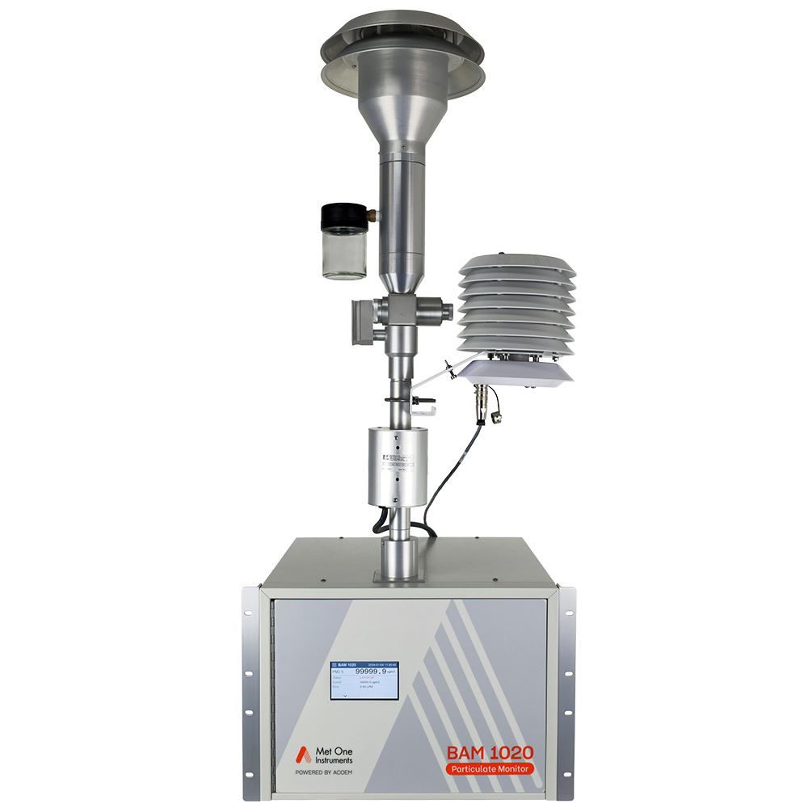
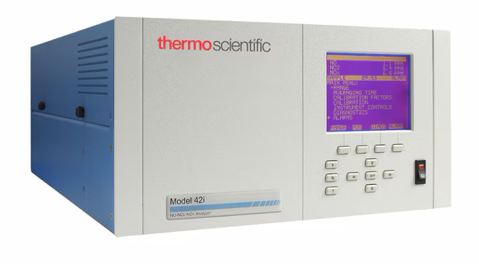

Updated: `r Sys.time()`

```{r setup, include=FALSE}
library(tufte)
# invalidate cache when the tufte version changes
knitr::opts_chunk$set(tidy = FALSE, cache.extra = packageVersion('tufte'))
options(htmltools.dir.version = FALSE)
```
# Introduction

## How we measure air quality?

Monitoring air pollution involves using various sensors to detect and quantify specific pollutants. These sensors range from high-precision regulatory instruments to affordable, portable devices for community science.

## Regulated Monitoring Instruments

The Environmental Protection Agency (EPA) regulates air quality monitoring to ensure accurate, reliable data collection that supports public health and environmental policy. Instruments approved by the EPA must meet rigorous standards for precision, accuracy, and long-term stability. This document explores the principles of operation, typical models, and setup requirements for these instruments.

EPA-approved instruments fall into two categories:
 - Federal Reference Methods (FRM): Gold-standard instruments that directly measure pollutants using well-established techniques.
 - Federal Equivalent Methods (FEM): Instruments that use alternative but scientifically validated techniques 
 
### Particulate Matter (PM) Monitoring

```{r BAM, fig.margin = TRUE, fig.cap = "The BAM 1020 is a continuous particulate monitor which automatically measures and records airborne particulate concentration levels (in milligrams or micrograms per cubic meter) using the principle of beta ray attenuation. Thousands of BAM-1020 units are  deployed worldwide, making the unit a common air monitoring platform.", fig.width=3.5, fig.height=3.5, cache=TRUE, echo=FALSE}



```

 - Beta Attenuation Monitors (BAM)

BAMs measure PM concentration by emitting beta particles through a collected particulate sample. The attenuation of beta radiation correlates with the mass of particles on the filter tape (Example Model: BAM-1020 (Met One Instruments), Figure \ref{fig:BAM}) .

Setup: These instruments are set-up in a weatherproof enclosure with temperature control. The inlet is configured to avoid water and large debris interference. Routine calibration using reference films is essential.

 - Gravimetric Samplers

These samplers collect particles on a pre-weighed filter over a set period. The filters are then weighed in a lab to determine particle mass concentration. Example Model: Andersen Series 2000

These include high-flow pumps with size-selective inlets (e.g., PM${2.5}$ or PM${10}$) and post-sampling conditioning and weighing in a controlled environment. Maintaining a regular flow rate is critical for instrument calibration.

 - Optical Particle Counters (OPCs)

 - Laser Scattering Sensors (e.g., Plantower PMS5003) measure particle concentration and size distribution based on light scattering. They are portable and cost-effective but require regular calibration and validation against reference instruments and not suitable for regulatory compliance.


### Gaseous Pollutant Monitoring

 - Ozone (O$_3$) Monitoring: UV photometric sensors
 
UV photometry measures ozone by detecting the absorption of UV light at 254 nm. The concentration is proportional to the absorbed light intensity (Example Model: TEI 49i (Thermo Fisher Scientific).

The setup includes zero and span calibration with certified ozone standards, an inlet manifold with PTFE tubing to prevent ozone loss, and periodic lamp intensity checks.

 - Nitrogen Oxides (NO$_2$, NO) Monitoring: Chemiluminescence analyzers, electrochemical sensors

```{r M42i, fig.margin = TRUE, fig.cap = "Measure the amount of nitrogen oxides in the air from sub-ppb levels up to 1000 ppb using chemiluminescence with the Thermo Scientific™ Model 42i-Y NOY Analyzer.The Model 42i-Y is a single chamber, single photomultiplier tube design that measures NOY which includes most oxides of nitrogen with the exception of NH3 and N2O.", fig.width=3.5, fig.height=3.5, cache=TRUE, echo=FALSE}



```

Principle of Operation:
Chemiluminescence analyzers detect NO$_2$ and NO by reacting it with ozone to produce light. The emitted light intensity is proportional to the NO concentration. Example Model: Model 200E (Teledyne API)

The instrument has a dual-channel design for NO and NO$_2$ separation. It requires regular calibration with NO and NO$_2$ gas standards, flow and pressure regulation to maintain stable measurements.

  - Sulfur Dioxide (SO$_2$): UV fluorescence sensors, electrochemical sensors
  
UV fluorescence sensors measure SO$_2$ by detecting the fluorescence of SO$_2$ molecules excited by UV light. The fluorescence intensity is proportional to the SO$_2$ concentration. Example Model: Model 43i-TLE (Thermo Fisher Scientific)

  - Carbon Monoxide (CO): Non-dispersive infrared (NDIR) sensors, electrochemical sensors
  
NDIR sensors measure CO by detecting the absorption of IR light at 4.6 µm. The absorption is proportional to the CO concentration. Example Model: Model 48i (Thermo Fisher Scientific)
  
  - Volatile Organic Compounds (VOCs): Photoionization detectors (PIDs), metal oxide sensors (MOS)
  
PIDs measure VOCs by ionizing molecules with UV light and detecting the resulting ions. The ionization intensity is proportional to the VOC concentration. Example Model: MiniRAE 3000 (RAE Systems)

  
## Calibration and Quality Assurance

All EPA-approved instruments require strict adherence to calibration schedules and quality assurance procedures, which includes the following:

 - Multipoint calibrations using NIST-traceable standards
 - Routine audits to verify long-term accuracy
 - Data validation protocols to screen for anomalies and instrument drift

### Environmental Factors

 - Temperature and Humidity Sensors

 - Wind Speed and Direction Anemometers

## EPA Instrument Requirements

EPA-approved instruments are essential for generating accurate air quality data. While they require significant infrastructure and maintenance, their reliability makes them indispensable for regulatory monitoring. Understanding their principles and setup requirements helps inform decisions on when to use high-precision instruments versus lower-cost sensor alternatives.

The U.S. Environmental Protection Agency (EPA) sets rigorous standards for air quality monitoring instruments, especially for compliance with the Clean Air Act and the National Ambient Air Quality Standards (NAAQS). Instruments used in official monitoring networks must meet specific criteria:

Federal Reference Methods (FRM) or Federal Equivalent Methods (FEM) designation

 - Strict accuracy, precision, and calibration requirements

 - Routine performance audits and quality assurance procedures

 - Minimum detection limits and response times suitable for capturing short-term pollution spikes

 - Durability to operate reliably across temperature and humidity ranges

For example, the EPA-approved BAM-1020 measures PM concentrations using beta-ray attenuation, providing legally defensible data for regulatory purposes.

Understanding these requirements is crucial for deciding whether to use low-cost sensors like Enviro+ for preliminary assessments or opt for certified instruments for policy-driven projects.

## Pimoroni Enviro+ Sensor Suite

The Pimoroni Enviro+ is a Raspberry Pi-compatible platform for environmental monitoring. It’s widely used for research and community-level air quality projects.

### Key Features

 - Particulate Matter: Plantower PMS5003 (PM$_{1.0}$, PM$_{2.5}$, PM$_{10}$)

 - Gas Detection: MICS6814 (CO, NO$_2$, VOCs)

 - Environmental Sensing: BME280 (temperature, humidity, pressure)

 - Light Measurement: LTR-559

 - Sound Levels: MEMS microphone

While not regulatory-grade, Enviro+ is excellent for exploratory studies, education, and real-time public data sharing.

# Building Sensors

## Raspberry Pi and Enviro+

The Raspberry Pi is a versatile, low-cost single-board computer that supports various sensors and peripherals. The Enviro+ HAT (Hardware Attached on Top) extends the Pi’s capabilities with a suite of environmental sensors.

### Hardware Setup

 - Raspberry Pi ZW or Z2W

 - Pimoroni Enviro+ HAT

 - MicroSD card with Raspberry Pi OS

 - Power supply and USB-C cable

 - Internet connection (Wi-Fi or Ethernet)
 
### Software Installation

 - Update the Raspberry Pi OS and install required packages

 - Download the Enviro+ Python library from Pimoroni’s GitHub repository

 - Run the example scripts to test the sensors and display data
 
### Sensor Calibration


### Sensor Deployment

 - Place the Enviro+ in a well-ventilated area away from direct sunlight and heat sources

 - Ensure the sensors are not obstructed by objects or surfaces that could affect readings

 - Monitor the Raspberry Pi remotely using SSH or VNC for headless operation

 - Schedule regular maintenance and calibration checks for long-term monitoring
 
# Data Collection and Analysis

## Data Collection Methods

There are several ways to collect air quality data using the Enviro+ sensor suite:

### Real-Time Monitoring (5C Networks won't allow us to do this!)

 - Use Python scripts to read sensor data and display it on the Raspberry Pi screen

 - Stream data to a cloud service or IoT platform for remote access

 - Set up alerts or notifications for abnormal readings
 
### Data Logging and Storage (This is what we will do!)

 - Save sensor data to a local file or database for offline analysis

 - Schedule data logging at regular intervals using cron jobs or systemd services

 - Implement data backup and archiving procedures to prevent data loss
 
### Data Sharing and Collaboration (Best Practice!)

 - Publish sensor data on a website or dashboard for public access

 - Share data with local authorities, researchers, or community groups for collaborative projects

 - Provide APIs or data feeds for developers to build applications or visualizations
 
### Data Retriveal from SD Cards

 - Marc will retrieve all the Pi SD cards
 
 - Still not sure how this will work! VNC file transfer is broken.
 
 
## Data Analysis Tools

Once you have collected air quality data using the Enviro+ sensor suite, you can analyze and interpret it to draw meaningful conclusions about the local environment.


 
### Data Visualization

 - Use the included Python scripts to visualize sensor data in real-time

 - Customize the scripts to log data to a file or publish it online

 - Integrate the Enviro+ with other Raspberry Pi projects for advanced applications
 
## Data Analysis and Interpretation

Once you have collected air quality data using the Enviro+ sensor suite, you can analyze and interpret it to draw meaningful conclusions about the local environment.

### Data Analysis Tools

 - Python: Use libraries like Pandas, Matplotlib, and Seaborn for data manipulation and visualization

 - Jupyter Notebooks: Create interactive reports with code, visualizations, and text explanations

 - R: Leverage the Tidyverse ecosystem for data wrangling and ggplot2 for plotting
 
### Interpretation Guidelines

 - Understand the sensor limitations and potential biases

 - Compare your data with official monitoring stations or other reference sources

 - Consider environmental factors that may influence the sensor readings

 - Communicate your findings clearly and transparently to stakeholders
 
### Example Analysis

 - Calculate daily averages of PM concentrations and gas levels

 - Compare the data with historical records or regulatory limits

 - Identify trends, patterns, or anomalies in the data

 - Visualize the results using time series plots, histograms, or box plots


## CO~2~ as a Fossil Fuel Pollutant

Human activities are driving climate change. And the impacts are being felt throughout the world --- and in spite of or because of climate activists are organizing around the issue. 

```{r maunaloa, echo=FALSE}
address <- "ftp://aftp.cmdl.noaa.gov/products/trends/co2/co2_mm_mlo.txt"
download.file(address, "maunaloa", quiet = F, mode = "w", cacheOK = T)
maunaloa <- read.table("maunaloa", skip=70)
names(maunaloa) <- c("year", "month", "decimal.date", "average", "interpolated", "trend", "days")
maunaloa$average[maunaloa$average==-99.99] <- NA
maunaloa <- data.frame(year=maunaloa$year, month=maunaloa$month, decimal.date=maunaloa$decimal.date, average=maunaloa$average)
```


```{r fig-margin, fig.margin = TRUE, fig.cap = "Observed CO~2~ concentrations (black) have been steadily increasing since we have begun measuring them in the 1950s, with a best fit line (red). Note that the slope or the rate of change is also increasing.", fig.width=3.5, fig.height=3.5, cache=TRUE, echo=FALSE}
par(las=1)
plot(maunaloa$decimal.date, maunaloa$average, type="l", ylab=expression(CO[2]*~ "(ppm)"), xlab="Year", 
main="Carbon Dioxide Concentration \n Mauna Loa, HI" )
#abline(coef(lm(average~year, data=maunaloa)), col="red", lwd=2)
muanaloa.loess = loess(average~year, data=maunaloa, span = 0.75, degree = 2, parametric = FALSE, 
  drop.square = FALSE, normalize = TRUE)
maunaloa$loess <- predict(muanaloa.loess)
lines(loess~decimal.date, data=maunaloa, lwd=1.4, col="red")
```

These activists include a diverse set of players --- many of whom be obscure. Others are well known and use media to draw attention to their views. 

But our question this year, is how do activitists use weather records and climate science as a whole to support their arguments?  Some may emphasize the uncertainty, others may rely on well trusted sources. Each use various sources of information to push for specific policy goals. As a class we summarized climate change patterns for various regions around the world while describing how various activists engage in policy or politics. 

These activists include a diverse set of players --- many of whom be obscure. Others are well known and use media to draw attention to their views. 

But our question this year, is how do activitists use weather records and climate science as a whole to support their arguments?  Some may emphasize the uncertainty, others may rely on well trusted sources. Each use various sources of information to push for specific policy goals. As a class we summarized climate change patterns for various regions around the world while describing how various activists engage in policy or politics. 

## Basics of Climate Science

Climate change science is complex -- but some relatively simple conclusions can be made: 1) humans are adding more  to the atmosphere than the Earth can assimilate; 2) CO~2~ acts as a greenhouse gas and can regulate the Earth's temperature; 3) the anthropogenic sources of greenhouse gases trap heat in the Earth's atmosphere; 4) the trapped heat is warming the Earth and having documented impacts on the Earth's surface. 

What are these regional impacts? How are regional stakeholders dealing with these impacts?

As we document below every region in the US and beyond respond differently to the planet's warming. As as such, actvitists will  the issues of climate change from different perspectives--- and play an important role in defining climate change narratives.

## Activitism 


## Data Science Deliverable

This data si

The data science deliverable for this segment is to report the PM2.5 levels in a US County of your choice, see the activity webpage for a demostration of the method. 

[Analyzing EPA PM2.5 Data webpage](https://marclos.github.io/EJnPi/Analyzing_EPA_PM2.5_Data)


