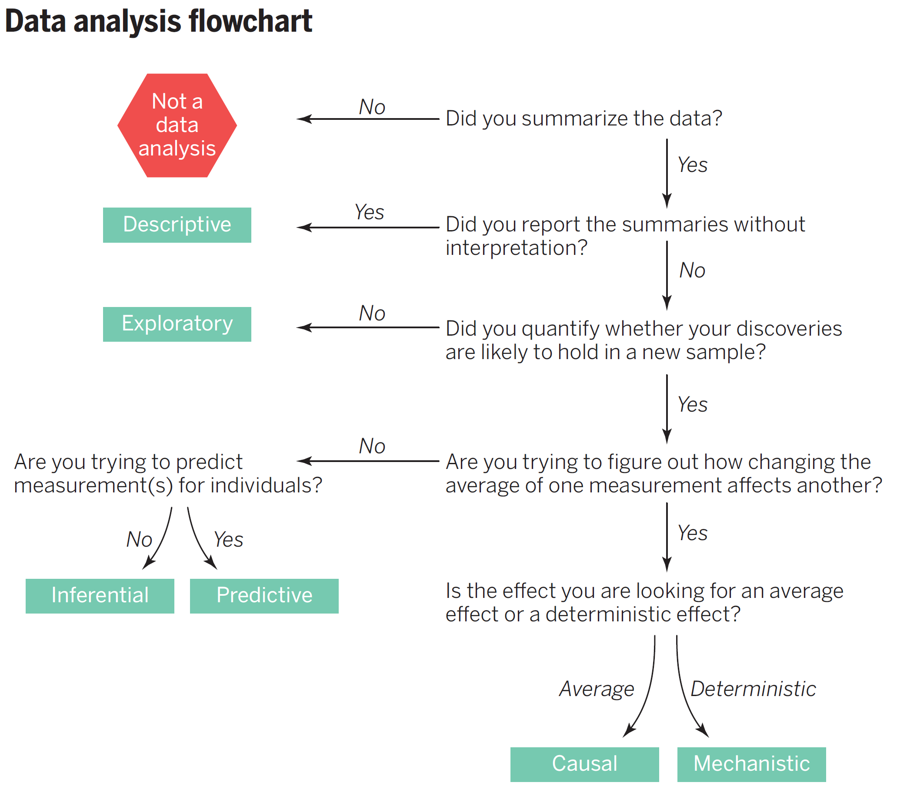

```{r setup, include=FALSE}
knitr::opts_chunk$set(echo = TRUE)
```


## Document History

### Round One

Each group will write two questions (and answers). Then at the top of each section, write out a short study guide that might include useful functions to understand, a link to a video, or “psuedo” code that might help.


- Group 1: 1a and 8b -- Creating Vectors
- Group 2: 2a and 7b -- Creating Dataframe in R
- Group 3: 3a and 6 -- Summary Statistics
- Group 4: 4a and 5b -- ANOVA
- Group 5: 5a and 3b -- T-Tests
- Group 6: 6a and 4b -- Correlation/Linear Regression
- Group 7: 7a and 1b -- Contingency Tables/Tests for Association
- Group 8: 8a and 2b -- Logistic Regression

Here's a [link to the google doc](https://docs.google.com/document/d/1aYsL29_yqikCuEjdDfPjcGZ2Om4mMJRX6ca9BoSVIFI/edit#heading=h.hgp5u648b92o)

## Round Two


In the same groups: 

1. Copy Rmd into Rstudio and knit and make sure it works.
2. Provide some backgroud on topic and why the information is useful. If you link to a video, please describe what the viewer is going to learn.
3.  Adjust your question to make it align with the course content. Change the examples to environmental data types. All dataset should have an EA theme. 

4. Make sure the code works and generates an output. 

5. Provide some help to reader to interpret results.

6. Add questions that addresses the flow chart above -- ask the reader to consider what type of analysis it might be and why!

Groups: 

- Group 1: vectors and logistics
- Group 2: dataframes and test for association
- Group 3: summary statistics (and a pdf images)
- Group 4: ANOVA and boxplots
- Group 5: t-tests and histograms
- Group 6: linear regression and corrletion

7. Cut the sections of the Rmd that you are not working on and when you are done, please submit on canvas.

# Working with R

## 1. Creating Vectors

Each group will write two questions (and answers). Then at the top of each section, write out a short study guide that might include useful functions to understand, a link to a video, or “psuedo” code that might help.

### Question 1a: How can you create a character vector with the names of three fruits?

Step-by-step guide: 
\begin{itemize}
	\item Determine the strings you want to include in your vector.
	\item Use the \texttt{c()} function to combine these strings.
	\item Assign the result to a variable.
\end{itemize}


Utilize the c() function to combine character strings into a vector: 

fruits_vector <- c("apple", "banana", "cherry")

```{r}
fruits_vector <- c("apple", "banana", "cherry")
```

Answer: 

```{r}
print(fruits_vector)
```


### Question 1b: Why are vectors commonly used in graphing data?

Answer: They are very versatile and can store multiple variables in a single date type.


## 2. Creating Dataframe in R

Introductory video: [R Tutorial - Using the Data Frame in R](https://www.youtube.com/watch?v=9f2g7RN5N0I)

A data frame is a collection of data in rows and columns
\begin{itemize}
	\item Rows = entries
	\item Columns = variables
\end{itemize}

It can only store vectors of the same length

Create a data frame with two vectors (vector_1 and vector_2)

```{r}
# df <- data.frame(vector_1, vector_2) PRODUCES AN ERROR...NOT SURE OF THE GOAL
```

### Question 2a: 

How do you create a complete data frame with the following information? Draw an example table for all viable scenarios

Scenario 1:


\begin{enumerate}
	\item Variables (Classes or Categories): Fruit, Vegetable
	\item Entries: Apple, Banana, Celery, Kale
\end{enumerate}


Scenario 2:
\begin{itemize}
	\item Variables: Birds, Dogs, Cats
	\item Entries: Parrot, Eagle, Husky, Rag Doll, Siamese

\end{itemize}

Answer:

```{r}
Fruit = c("Apple", "Banana")
Vegetable = c("Celery", "Kale")

Scenario1 = data.frame(Fruit, Vegetable)
```


```{r}
Birds= c("Parrot", "Eagle")
Dogs = c("Husky", "Rag Doll")
Cats = c("Siamese")

Scenario2 = data.frame(Birds, Dogs, Cats)
```


We cannot create a dataframe for scenario 2 because the Dog vector has one less entry than the other two vectors.

MLH NOTE: I didn't get an error, not sure what the goal is here.

## 3. Summary Statistics

So, what are summary statistics? Check out this 5-minute video: 

Basic summary statistics in R. Pay close attention to the code used to find the mean, median, and standard deviation. 

### Question 3a: 

Create a dataframe based on the following table:
\begin{table}
	\centering
		\begin{tabular}{cllc}
Ranking		& 	Animal 	& Country 		& Avg. Sleep Hours \\
1					& 	Koala		& Australia		& 21 \\
2					& Hedgehog  & Italy       & 18 \\
3					& Sloth			& Peru        & 17 \\
4					& Panda 		& China       & 10 \\
		\end{tabular}
\end{table}

Answer: 

MLH NOTE: produces an error...not sure what the goal of the line Summary Statistics.

```{r}
ranking <- 1:4
animal <- c('koala', 'hedgehog', 'sloth', 'panda')
country <- c('Australia', 'Italy', 'Peru', 'China')
avg_sleep_hours <- c(21, 18, 17, 10)
super_sleepers <- data.frame(ranking, animal, country, avg_sleep_hours)
print(super_sleepers)
# Summary Statistics -- COMMENTED OUT PRODUCED ERROR
```


### Question 3b: When might it be helpful to use summary statistics? 


Answer: When you want to evaluate a dataset and learn more information about the distribution! It is a helpful first step before undertaking more complex tests on the data 


### Question 3b: 

In your RStudio, load the dataset cars. This is built into the software! 

Now, please provide some of the summary statistics for this dataset. This includes the mean and median for speed and distance. It might be helpful to View the dataset before starting to orient yourself within the data. 

No code given...

```{r}
# No code given
```

View: this is what the first 15 columns should look like
 

Mean Values: speed = 15.4, distance = 42.98

Median Values: speed = 15.00, 36.00

## t-Test: Comparing Two Populations

To calculate a t-test, you need the mean values from each data set, the standard deviation, and how many data values there are.

Pseudo code 
t.test(x, y,
      alternative = c("two.sided", "less", "greater"),
      mu = 0, paired = FALSE, var.equal = FALSE,
      conf.level = 0.95, ...)


https://www.rdocumentation.org/packages/stats/versions/3.6.2/topics/t.test 


### 4a: What is a t-test? What information do you need to know in order to conduct a T-test?

Answer: T-tests are a type of inferential statistic used to determine statistical significance between the means of two variables. T-tests are used to test whether or not a hypothesis is statistically significant.

T-tests can be dependent or independent.

### 4b: What is a practical use of a t test? 

Comparing efficacy of different trial medications or treatments


### 4c: Perform a two-sample t-test to compare the means of the treatment and control groups.


Fake data set:
```{r, eval=FALSE}
# Group 1 (Treatment Group):
25, 28, 30, 32, 26
# Group 2 (Control Group):
20, 22, 24, 21, 23
```


NOTE: not sure how this would work given the code above, and change to eval=FALSE because of errors.

What type of graph is useful for showing a t-test? 

Boxplot
Command: boxplot()

```{r}
# no code given for answer
```

## ANOVA

Analysis of Variance (ANOVA) in R (very helpful explanation) 

Helpful tips:

The summary() function provides an ANOVA table, which includes statistics such as the F-statistic, p-value, and degrees of freedom. These statistics help to determine whether the differences between group means are statistically significant.
You can use ANOVA to analyze data for your NSF experiment! Especially if you have different groups you are trying to compare and analyze
b) 
What is the ANOVA statistical test? Statistics 101: One-way ANOVA, A Visual Tutorial - YouTube
ANOVA stands for analysis of variance
It is used to categorize differences in data, or variances, into different groups for future statistical tests
A one-way ANOVA is for three or more groups of data
If there is no variance the ANOVA f-ratio will be 1

### Question 5a: What is ANOVA used for? 

Answer: ANOVA (Analysis of Variance) in R is a statistical technique used to see how a quantitative dependent variable changed compared to categorical independent variables

What code would you use for ANOVA on this fake dataset?

### Generate fake data
```{r}
group1 <- rnorm(30, mean = 10, sd = 2)
group2 <- rnorm(30, mean = 12, sd = 2)
group3 <- rnorm(30, mean = 15, sd = 2)
```

### Combine data into a dataframe
```{r}

fake_data <- data.frame(
  Group = rep(c("A", "B", "C"), each = 30),
  Dependent_Variable = c(group1, group2, group3)
)
```


### Show the first few rows of the dataset
```{r}
head(fake_data)
```


Answer: 

```{r}
result <- aov(Dependent_Variable ~ Group, data = fake_data)
summary(result)
```


What is an example of ANOVA code?

```{r}
# Fake data set
group1 <- c(35, 38, 42, 40, 36)
group2 <- c(28, 32, 30, 34, 31)
group3 <- c(45, 48, 50, 47, 49)

# Combine data into a data frame
data <- data.frame(Group = rep(c("Group1", "Group2", "Group3"), each = 5),
                   Value = c(group1, group2, group3))

# Run ANOVA test
result <- aov(Value ~ Group, data = data)

# Summary of ANOVA
summary(result)
```

## Linear Regression

### Question 6a: Make a linear regression figure based on the data below

Fake data set:
Age: 1, 2, 3, 4, 4, 5, 7, 8, 8, 10, 13
Height(in): 30, 37, 40, 42, 43, 48, 49, 53, 50, 62

Answer:
```{r}
age <- c(1, 2, 3, 4, 4, 5, 7, 8, 8, 10, 13)
height <- c(30, 37, 40, 42, 43, 48, 49, 51, 53, 50, 62)

kids <- lm(height ~ age)
summary(kids)
plot (height ~ age)
abline (coef(kids))
```


### Q6b: What relationship does a linear regression model describe?

Answer: A linear regression model describes the relationship between a dependent variable, y, and one or more independent variables, X.

Q: What command in R allows you to review the models coefficients and see detailed information about the model

A:summary(lmheight) 


## Contingency Table

STUDY GUIDE
Use the table(row variable $ column variable) function to parse the data
https://bookdown.org/kdonovan125/ibis_data_analysis_r4/working-with-tables-in-r.html 


### Q1: Using the data below, create a contingency table


df = 


A1: code doesn't work... Not sure what to do here...

```{r, eval=FALSE}
table(Bees
Moths
Total
Native_garden
126
7
133
Non-native_garden
14
0
14
Total
140
7
147
```


## Logistic Regression


What is a logistic regression? Watch this 8 min video to find out!


### Q8a: What is a logistic regression and what are they used for?

Logistic regression estimates the probability of an event occurring, such as voted or didn’t vote, based on a given data set of independent variables. They are used commonly for prediction and classification problems. They are best used in scenarios where there is a binary outcome (ie. yes or no, black of white, etc.)

### Q8b: What are the characteristics of data sets that can be used to create logistic regression? 

answer : Logistics regression graphs can be made with data sets that contain continuous variables (Like temperature, or depth) and a binary/ categorical outcome variable (yes/no , 1/0, on /off). Sample sizes are usually larger and assumes a linear relationship between variables and categorical outcomes. 


See this UCLA website that describes how to use a logistic regression in R and gives examples.

```{r}
# Create Data Set
Customer_ID <- c(1, 2, 3, 4, 5, 6, 7, 8, 9)
Age <- c(55, 19, 50, 21, 45, 46, 63, 33, 44)
Gender <- c("Male", "Male", "Female", "Male", "Male", "Female", "Female", "Male", "Male")
Item_Purchased <- c("Blouse", "Sweater", "Jeans", "Sandals", "Blouse", "Sneakers", "Shirt", "Shorts", "Coat")
Category <- c("Clothing", "Clothing", "Clothing", "Footwear", "Clothing", "Footwear", "Clothing", "Clothing", "Outerwear")
Purchase_Amount_USD <- c(53, 64, 73, 90, 49, 20, 85, 34, 97)

# Combine data into a data frame
data <- data.frame(Customer_ID, Age, Gender, Item_Purchased, Category, Purchase_Amount_USD)
```
                   

NO CODE GIVEN FOR ANSWER
 


