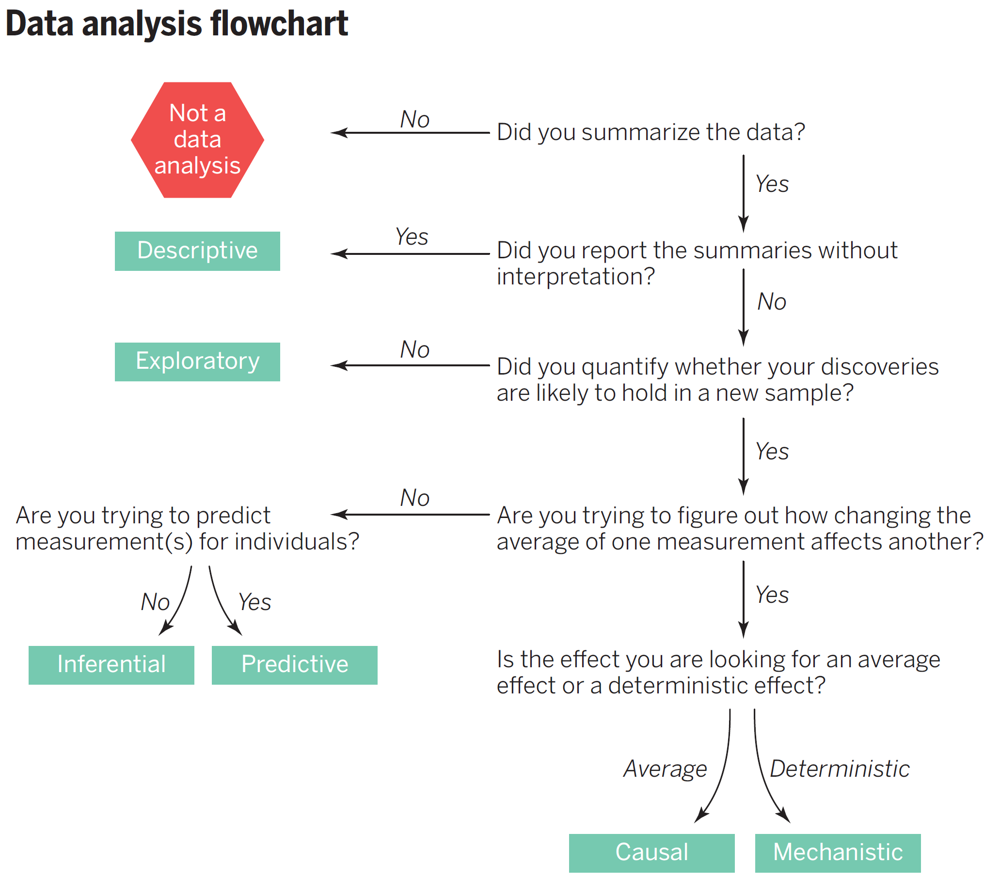

```{r setup, include=FALSE}
knitr::opts_chunk$set(echo = TRUE)
```


## Document History

### Round One

Each group will write two questions (and answers). Then at the top of each section, write out a short study guide that might include useful functions to understand, a link to a video, or “psuedo” code that might help.


- Group 1: 1a and 8b -- Creating Vectors
- Group 2: 2a and 7b -- Creating Dataframe in R
- Group 3: 3a and 6 -- Summary Statistics
- Group 4: 4a and 5b -- ANOVA
- Group 5: 5a and 3b -- T-Tests
- Group 6: 6a and 4b -- Correlation/Linear Regression
- Group 7: 7a and 1b -- Contingency Tables/Tests for Association
- Group 8: 8a and 2b -- Logistic Regression

Here's a [link to the google doc](https://docs.google.com/document/d/1aYsL29_yqikCuEjdDfPjcGZ2Om4mMJRX6ca9BoSVIFI/edit#heading=h.hgp5u648b92o)

## Round Two



New Groups: 

- Group 1: vectors and test for association (contingency tables)
- Group 2: dataframes and logistic regression
- Group 3: summary statistics (and a probability distribution function image)
- Group 4: ANOVA and boxplots and causuality
- Group 5: t-tests and histograms
- Group 6: linear regression and correlation (what's the difference)


1. Copy Rmd into Rstudio and knit and make sure it works.


2. For each section, we would like our peers to have some background on topic and why the information is useful. If you link to a video, please describe what the viewer is going to learn.

3.  Adjust your question to make it align with the course content. Change the examples to environmental data types. All datasets should have an EA theme. 

4. Use vectors and data frames in problem sets as much as possible. 

5. Make sure the code works and generates an output. The guide should work!

6. Provide some help to reader to interpret results.

7. Add questions that addresses the flow chart above -- ask the reader to consider what type of analysis it might be and why!

8. Cut the sections of the Rmd that you are not working on and when you are done (don't cut the preamble stuff). 

9. please submit a working Rmd file on today's canvas assignment and change the folks in your group in the "author" in the Rmd file.

## Round Three: 

### Marc's Synthesis

1. I combined each submission, tricky since some didn't cut out the sections they didn't work on, so I had to compare line-by-line. Must be a better way!

2. I updated the data sets to be more environmental in nature, using and modifying the data sets from the 2024 class.

3. I formatted each section so I could a "stand alone" lesson and added text as a introction and some highlights of the topic. 

### Videos
3. Created videos so that students have a idea of how to analyze their pilot projects.

### Peer Evaluation -- Your Turn!

4. Each for each assigned section, students will 
a. watch 3 movies and make suggestions to improve content of the video;
b. test the example in R and note any sources of confusion; 
c. read the text and make suggestions to improve clarity
d. search the web for resources that you think might help and explain why.

Please submit by April 26th.

Here are the groupings: 

- Derek: Sections 1, 4, and 6
- Kai: Sections 1, 4, and 7 
- Willow: Sections 1, 4, and 8
- Haddly B: Sections 1, 4, and 9
- Carolyn: Sections 1, 4, and 10
- Mullan: Sections 2, 4, and 6
- Xander: Sections 2, 4, and 7
- Anna: Sections 2, 4, and 8
- Haddly J: Sections 2, 4, and 9 
- Hanna: Sections 2, 4, and 10
- William: Sections 3, 4, and 6
- Sofia: Sections 3, 4, and 7 
- Wali: Sections 3, 4, and 8
- Alicia: Sections 3, 4, and 9 
- Thalia: Sections 3, 4, and 10
- Willa: Sections 1, 5, and 6
- Zumaya: Sections 1, 5, and 7 
- Miranda: Sections 1, 5, and 8
- Shelby: Sections 1, 5, and 9
- Annabel: Sections 1, 5, and 10
- Isa: Sections 2, 5, and 7
- Camille: Sections 2, 5, and 8
- Ella: Sections 2, 5, and 9

\newpage
# Working with R

## 1. Vectors

Vectors are versatile and can store multiple variables in a single date type, either character strings or numeric values, but not both. 

Step-by-step guide: 
\begin{itemize}
	\item Determine the numeric values or character strings you want to include in your vector.
	\item Use the \texttt{c()} function to combine numeric values or character strings. Character strings are enclosed in quotes, or R will look for objects with that name.
	\item Assign the result to a variable.
	\item Print the variable to see the result.
\end{itemize}

### Q1a: Create a vector of numeric tree heights

Tree height can be used to estimate the shading of a park. You have surveyed the tree heights in several open areas in the 5C and will use these to estimate the amount of shade on campus.   

You've surveyed all the trees in your local park and recorded their height, in feet, as follows:  50, 25, 36, 27, 82, 39, 55, 62

```{r}
tree_height <- c(50,25,36,27,82,39,55,62,33)
print(tree_height)
```

In addition, we collected tree height data from a 2nd city park: 

```{r}
tree2_height <- c(60,27,70,29,80,39,40,60)
```

We can display the distribution of the data using the hist() function in Section [Q5a: Histogram of Tree Height Vector]. In addition, we analyze the differences between the two populations in Section [Q7a: Perform a two-sample t-test to compare tree height means.].

### Q1b: Create a vector of chacter strings of ant species

Utilize the c() function to combine character strings into a vector. For example, in this case, we enumerated the number of ant genera in several Claremont parks. In this case, we crate a vector of 5 ant groups and then sample (using psuedo-random numbers) to create a random set of results into a new vector.

```{r}
ant_species <- c("Formica", "Camponotus", "Lasius", "Myrmica", "Tetramorium")
set.seed(29330)
ant_vector <- sample(ant_species, 19, replace = TRUE)
```

Let's see what it looks like: 

```{r}
print(ant_vector)
```
We summarize the data in Section [Q4a: Summary of Categorical Data]. These data can only be used as a exploratory analysis, there is no way to use any other statistical tests on this data.

### Q1c: Vector of Rainfall Data

We going to create a vector of random numbers that represent 25 years of rainfall data using a lognormal distribution with the following parameter: mean = 25, sd = 10.

```{r}
set.seed(11144)
rainfall_notrend <- rlnorm(n =25, meanlog = 1.5, sdlog =1); #hist(rainfall)
```

To make the data more interesting, we'll add a trend to the data, where amount goes up by 1% of the mean each year. Note: I should have this amoratized using a loop, but didn't have time to write the code.

```{r}
rainfall_trend <- rainfall_notrend * (1 + seq(0, 0.24, 0.01))
rainfall_trend
```

We visualize the data using a probability distribution function in Section [Q5c: Plotting Rainfall with a Probabaility Distribution Function] and analyze the trend in Section [Q9a: Linear Regression of Rainfall Data] based on a dataframe created in Section [Q2b: Data Frame with Rainfall].

## 2. Dataframes in R

Introductory video: [R Tutorial - Using the Data Frame in R](https://www.youtube.com/watch?v=9f2g7RN5N0I)

A data frame is a collection of data in rows and columns
\begin{itemize}
	\item Rows = entries (observations)
	\item Columns = variables (composted of vectors)
\end{itemize}

Note: A dataframe can only store vectors of the same length, you you might get an error.


### Q2a: Creating a Dataframe with Three Compost Treatments

Data are use to evaluate compost maturity from there treatments "A", "B", and "C": We'll select 10 measures from a random normal distribution with various means and a standard deviation of 2 and round to the nearest 0.1. Note: we created a missing value to our group3.

```{r}
set.seed(66778)
group1 <- round(rnorm(10, mean = 11, sd = 2.2), 1)
group2 <- round(rnorm(10, mean = 12, sd = 2.2), 1)
group3 <- c(round(rnorm(9, mean = 14, sd = 2.2), 1), NA) # Add an NA value to the last group
```

To create the dataframe, we'll need to add the treatments so they are repeated 10 times for each treatment. 
```{r}
compost_data <- data.frame(
  Group = rep(c("A", "B", "C"), each = 10),
  Dependent_Variable = c(group1, group2, group3)
)
```

Show the first 6 rows of the dataset

```{r}
head(compost_data)
```

We'll generated summary statistics from the data in Section [Q4b: Using the Summary() function on Compost Maturity Data] and analyzed the variance (ANOVA) in Section [Q8a: ANOVA for Compost Data]

### Q2b: Data Frame with Rainfall

We created 25 years of data using a lognormal distribution and then create a trend in the vector. Now we will create a dataframe with the following columns: Year, Rainfall_Notrend, and Rainfall_Trend from vectors generated from Section [Q1c: Vector of Rainfall Data].

```{r}
year <- 1995:2019
rainfall.df <- data.frame(Year = year, No_Trend = rainfall_notrend, Trend = rainfall_trend)
```

Now let's check the dataframe:

```{r}
str(rainfall.df)
head(rainfall.df)
```
We visualize the data using a probability function in Section [Q5c: Plotting Rainfall with a Probabaility Distribution Function] and analyze for a trend in Section: [Q9a: Linear Regression of Rainfall Data].

### Q2c: Data Frame with Squirrel Reproduction

We have collected data on the weight of ground squirrels and the number of offspring they have. We will create a dataframe with the following columns: Ground_Squirel_ID, Weight, and Off_spring.

```{r}
Ground_Squirrel_ID <- 1:20
Weight <-     c(250, 340, 550, 190, 509, 609, 745, 846, 963, 433, 444, 833, 
                355, 455, 300,555, 666, 777, 888, 599)
Off_spring <- c(0,     0,   1,   0,   0,   0,   1,   0,   1,   1,   0,   1,  
                0,   0,   0,  0,  1,    1,  1,    1)

Ground_Squirrel_data <- data.frame(Ground_Squirrel_ID, Weight, Off_spring)
```

We dispaly the data in Section [Q5f: Scatterplot of Ground Squirrel Data] and analyze the data in Section [Q10a: Ground-Squirrel Reproduction with Logistic Regression].


## 3. Matrices

Matrices are used to store data in a two- or mult-dimensional format. They are similar to data frames, but all elements must be of the same data type. Once you have created a matrix, you can perform mathematical operations on it, such as addition, subtraction, and multiplication -- following the rules of matrix algebra.

Step-by-Step Guide:
\begin{itemize}
	\item Make a table of data in rows and columns to ensure the matrix orientation will be aligned as expected;
	\item Make a vector of data;
	\item Use the matrix() function to create a matrix; and
	\item Optional: Add row and column names.
\end{itemize}

For our purposes, we'll make a matrix of the following data:

\begin{table}[h]
	\centering
		\begin{tabular}{cccc}
	&	Bees & Butterflies & Beetles \\
Vegetable Garden &			1 & 2 & 2 \\
Flower Garden &			15 & 6 & 22\\
Herb Garden	&		7 & 11 & 15 \\
		\end{tabular}
\end{table}	

		
### Q3a: Create a Matrix of Pollinator Data

```{r}
pollinators_type <- c("Bees", "Butterflies", "Beetles")
garden_type <- c("Vegetable garden", "Flower garden", "Herb garden")

pollinator_data = c(6, 27, 16, 5, 12, 22, 14, 18, 25)
# Generate fake data
pollination_matrix = matrix(pollinator_data, nrow = 3, ncol = , byrow=TRUE)

pollination_matrix
```

Sometimes it's nice to name the rows and columns to make sure you can keep track of the data.

```{r}
colnames(pollination_matrix) <- garden_type
rownames(pollination_matrix) <- pollinators_type
```


```{r}
pollination_matrix
fisher.test(pollination_matrix)
```

We will use a [Q6a: Fisher Test of Pollinator Data] to analyze this data.

### Q3b: Matrix with PFAS and Cancer

We have collected data on the levels of PFAS in the water and the number of cancer cases in a community. We will create a matrix with the following columns: PFAS_Level, Cancer_Cases.

```{r}
PFAS_level <- c("PFAS Present", "PFAS Absent")
Cancer_Cases <- c("Cancer", "No Cancer")
                  
Cancer_Data <- c(4033, 3830, 19033, 18880)
Cancer_matrix = matrix(Cancer_Data, nrow = 2, ncol = , byrow=TRUE)

colnames(Cancer_matrix) <- PFAS_level
rownames(Cancer_matrix) <- Cancer_Cases

Cancer_matrix
```
 We will analyze the data with a chisqure test in Section [Q6b: Chi-squared Test of PFAS Cancer Data].
 
 
## 4. Summary Statistics

When you want to evaluate a dataset and learn more information about the distribution! It is a helpful first step before undertaking more complex tests on the data . So, what are summary statistics? Check out this 5-minute video: 

Basic summary statistics in R. Pay close attention to the code used to find the mean, median, and standard deviation. 

### Q4a: Summary of Categorical Data

The table() function is used to summarize categorical data. It will provide a frequency count of the data.
```{r}
table(ant_vector)
```

### Q4b: Using the Summary() function on Compost Maturity Data

Provide some of the summary statistics for this dataset, created in Section [Q2a: Creating a Dataframe with Three Compost Treatments]. 

```{r}
summary(compost_data)
```

The summary works well for the dependent variable, but not for the treatment group. We can use the table() function to summarize the treatment group. 

```{r}
table(compost_data$Group)
```
Which tells us that there are 10 observations for each group. Not that interesting. I would rather use str() to get a better idea of the data. 

```{r}
str(compost_data)
```


### Q4c: Mean, Median, and Standard Devivation

To get to the summary stats, I prefer using the mean(), median(), and sd() functions. While we created the data as a data frame in Section [Q2a: Creating a Dataframe with Three Compost Treatments], notice that we need to extract the vector from the data frame to use the mean(), median(), and sd() functions.


```{r}
mean(compost_data$Dependent_Variable)
median(compost_data$Dependent_Variable)
sd(compost_data$Dependent_Variable)
```
All good, but if you want to look at how these data vary by category, then we need to use boxplot() function. See Section [Q5d: Boxplot of Compost Maturity Data] and conduct an analysis of variance (ANOVA) in Section [].

## 5 Visualing Data, Distributions, and Relationships

### Q5a: Histogram of Tree Height Vector

A histogram is a visual representation of the distribution of quantitative data. It is a useful tool for understanding the shape of the data, as well as the center and spread of the data. 

Using the tree height vectors from Section [Q1a: Create a vector of numeric tree heights], we can put two histograms side-by-side.

```{r}
par(mfrow=c(1,2), las=1)
p1<-hist(tree_height)
p2<-hist(tree2_height)
```

Notice we use a par() function define the panel layout. The mfrow argument is set to c(1,2), which means that we want to have one row and two columns of plots. The las argument is set to 1, which means that the axis labels are horizontal. 

We can now analyze the data using a t-test as demonstrated in Section [7 t-test: Comparing Two Populations].

### Q5b: Overlaying Histograms 

Alternatively, we can overlay two histograms to compare the data. Did you find one method superior to the other? Personally, I (marc) think the side-by-side is better.

```{r}
plot(p1, col=rgb(0,0,1,1/4), xlim=c(0,100), 
     main="Tree Height from 2 Sites", las=1, xlab="Tree Height (units?)")  # first histogram
plot(p2, col=rgb(1,0,0,1/4), xlim=c(0,100), add=TRUE)
```

Pretty neat how the colors were defined with the rgb() function. The add=TRUE argument is used to overlay the second histogram on the first.

### Q5c: Plotting Rainfall with a Probabaility Distribution Function

Instead of using a histogram, we can also use a theoretical probability distribution to represent the data.

In the example below, we used both the normal probability distribution and the lognormal probability distribution. Which one do think models the data better? I suggest you compare these to a histogram. Data source: Section [Q1c: Vector of Rainfall Data], plotted in Section [Q5e: Scatterplot of Rainfall Data] and analyzed in Section [Q9a: Linear Regression of Rainfall Data].


```{r}
range(rainfall.df$No_Trend)
x<-seq(from=-5,to=60,length.out=100)
plot(x,dnorm(x, mean(rainfall.df$No_Trend), sd=sd(rainfall.df$No_Trend)), 
     ty='l', col='red', xlim=c(-5, 60), ylim=c(0, 0.1))
lines(x,dlnorm(x, meanlog = mean(rainfall.df$No_Trend), 
               sdlog = sd(rainfall.df$No_Trend)), ty='l', col='blue')
```

The probability distribution of the data is important because it can help us understand the data better. We can use the probability distribution to make predictions about the data. In this case, we see that a normal distribution doesn't fit the data well, but a lognormal distribution does -- and that is important to know when we are making predictions about the data and making sure we don't try to predict numbers that might be negative!

### Q5d: Boxplot of Compost Maturity Data

We generated these data in Section [Q2a: Creating a Dataframe with Three Compost Treatments]. We can use the boxplot() function to compare the three treatments. We can extract the vector with the formula notation or just refer to the varible in the dataframe. See how the x- and y-axis labels are different? There's an easy fix with the xlab and ylab arguments.

```{r}
par(mfrow=c(1,2))
boxplot(compost_data$Dependent_Variable ~ compost_data$Group)
boxplot(Dependent_Variable ~ Group, data=compost_data)
```

It certainly appears that the treatments are different from each other. We analyze the data created in Section [Q8a: ANOVA for Compost Data] with an ANOVA in Section [Q8a: ANOVA for Compost Data].

### Q5e: Scatterplot of Rainfall Data

Since we have two sets of data, we can use a scatterplot to see if there is a relationship between the two sets of data.  Of course, we don't know if there is a trend, so we test that in section [Q9a: Linear Regression of Rainfall Data] and visualize the trend line sin Section [Q9b: Make Trendline Prediction with Rainfall Data].


```{r}
plot(No_Trend ~ year, rainfall.df, col = "blue", ylim=c(0, 55), 
     xlab="Year", ylab="Rainfall (mm)", las=1)
points(Trend ~ year, rainfall.df, col = "red", pch=20)
```

Need to add a legend!  Red dots are the trend data, blue dots are the no trend data. 


### Q5f: Scatterplot of Ground Squirrel Data

It certainly looks like the weight of the mother is related to the number of offspring. We will test this in Section [Q10a: Ground-Squirrel Reproduction with Logistic Regression] and develop a prediction in Section [Q10c: Predicting Ground-Squirrel Reproduction].

```{r}
plot(Off_spring ~ Weight, data= Ground_Squirrel_data, col="blue", pch=20, las=1)

```

## 6. Tests for Association

Test for association are use to determine if two or more categorical variables are independent.
If we can reject the hypothesis, then we can conclude that there is an association between the variables.

In statistics, a contingency table (also known as a cross tabulation or crosstab) is a type of table in a matrix format that displays the multivariate frequency distribution of the variables.

-- What kind of variables: Categorical (nominal or ordinal with a few categories)
-- Common Applications: Association between two categorical variables.

The chi-squared test tests the hypothesis that there is no relationship between two categorical variables. It compares the observed frequencies from the data with frequencies which would be expected if there was no relationship between the variables. We use a fisher test when the sample size is small.

We can use the table(r) function to parse the data, See this [link](https://bookdown.org/kdonovan125/ibis_data_analysis_r4/working-with-tables-in-r.html) for more information. In addition, here a [link](https://bookdown.org/kdonovan125/ibis_data_analysis_r4/working-with-tables-in-r.html) for a simple explanation from R website.


### Q6a: Fisher Test of Pollinator Data

Determine if there is an association between the pollinator type and garden type. See data matrix in Section [Q3a: Create a Matrix of Pollinator Data].
```{r}
fisher.test(pollination_matrix)
```

### Q6b: Chi-squared Test of PFAS Cancer Data

We analyze the data matrix in Section [Q3b: Matrix with PFAS and Cancer].

```{r}
chisq.test(Cancer_matrix)
```

## 7 t-test: Comparing Two Populations

T-tests are a type of inferential statistic used to determine statistical significance between the means of two variables. T-tests are used to test whether or not a hypothesis is statistically significant.

T-tests can be dependent or independent.

Comparing efficacy of different trial medications or treatments
To calculate a t-test, you need the mean values from each data set, the standard deviation, and how many data values there are.

https://www.rdocumentation.org/packages/stats/versions/3.6.2/topics/t.test 


### Q7a: Perform a two-sample t-test to compare tree height means.

We'll use the data from Section [Q1a: Create a vector of numeric tree heights], which we visualized the distribution in Section [Q5a: Histogram of Tree Height Vector].

```{r}
t.test(tree_height, tree2_height)
```
The results of the t-test show that the p-value is not less than 0.05, which means that we can reject the null hypothesis that the means of the two groups are equal.

## 8. ANOVA: Comparing Three or More Populations

ANOVA (Analysis of Variance) in R is a statistical technique used to see how a quantitative dependent variable changed compared to categorical independent variables

[Link to Video: Analysis of Variance (ANOVA) in R](https://www.youtube.com/watch?v=qrP7evoNCy4)

ANOVA stands for analysis of variance. A one-way ANOVA is for three or more groups of data

(very helpful explanation) 

Helpful tips:

\begin{itemize}
\item The summary() function provides an ANOVA table, which includes statistics such as the F-statistic, p-value, and degrees of freedom. These statistics help to determine whether the differences between group means are statistically significant.

\item You can use ANOVA to analyze data for your NSF experiment! Especially if you have different groups you are trying to compare and analyze

\item It is used to categorize differences in data, or variances, into different groups for future statistical tests

\item If there is no variance the ANOVA f-ratio will be 1 (higher values lead to lower p-values).
\end{itemize}


### Q8a: ANOVA for Compost Data

We created the data in Section [Q2a: Creating a Dataframe with Three Compost Treatments] and displayed the data in Section [Q5d: Boxplot of Compost Maturity Data].

We can use anova(lm()) or an easier method: aov() and then use the summary() function to coerce the statistics from the object.
```{r}
compost.anova <- anova(lm(Dependent_Variable ~ Group, data=compost_data))
compost.aov <- aov(Dependent_Variable ~ Group, data=compost_data)

```

```{r}  
compost.anova
```

```{r}
summary(compost.aov)
```


## 9. Linear Regression

A linear regression model describes the relationship between a dependent variable, y, and one or more independent variables, x.

Once the data are coerced into by the lm() function, where y = f(x), we can use the summary() function to extract the model's coefficients and see detailed statistical analysis.

### Q9a: Linear Regression of Rainfall Data

We use the rainfall data created in Section [Q1c: Vector of Rainfall Data] to analyze for a trend. Since we already found that a linear regression might be a good model to use from the scatterplot (Section [Q5e: Scatterplot of Rainfall Data]), we can now run the linear regression.

we run the linear regression, let's loot at both the trend and nontrend:

```{r}
lm_notrend <- lm(rainfall_notrend ~ year, data = rainfall.df)
lm_trend <- lm(rainfall_trend ~ year, data = rainfall.df)

summary(lm_notrend)
summary(lm_trend)


```
The "Estimate" for the year, is the slope of the line and the p-value is the significance of the slope. In both (identical) outputs, we cannot reject the null hypothesis that the slope is zero, i.e. there is no trend. 

How could we adjust the trend data to make it significant?

### Q9b: Make Trendline Prediction with Rainfall Data

We can use the predict() function to make predictions based on the linear regression model beyond the dataset. 

```{r}
years = 1995:2025
prediction = predict(lm_trend, newdata = data.frame(year = years))

plot(Trend ~ year, data = rainfall.df, xlim=c(range(years)), 
     las=1, xlab="Year", ylab="Rainfall (mm)", main="Rainfall Trend")
lines(years, prediction, col = "red")


```


## 10. Logistic Regression

Logistic regression estimates the probability of an event occurring, such as voted or didn't vote, based on a given data set of independent variables. They are used commonly for prediction and classification problems. They are best used in scenarios where there is a binary outcome (ie. yes or no, black of white, etc.)

Logistics regression graphs can be made with data sets that contain continuous variables (Like temperature, or depth) and a binary/ categorical outcome variable (yes/no , 1/0, on /off). Sample sizes are usually larger and assumes a linear relationship between variables and categorical outcomes. 

What is a logistic regression? Watch [this video](https://pomona.box.com/s/2lxorc9w0k2u0yg4g1zyo7vw0nxtbb8b) to find out!

In other words a generalized linear model is just a linear model, but with a modified error distribution that better captures the data generating process that has helped in the creation of your data. For instance, if your responses are successes and failures, which are typically coded as 1s and 0s, it is pretty clear that 1s and 0s are not normally distributed data nor would they have a normal error distribution on their residuals. In cases like these we need to modify our underlying linear modeling distribution to best match what distribution has helped shape our data.

A GLM will look similar to a linear model, and in fact even R the code will be similar. Instead of the function lm() will use the function glm() followed by the first argument which is the formula (e.g, y ~ x). Although there are a number of subsequent arguments you may make, the argument that will make your linear model a GLM is specifying the family, which you will set to poison or binomial or whatever error distribution you are applying to this model.

### Q10a: Ground-Squirrel Reproduction with Logistic Regression

Using the data frame we created in Section [Q2c: Data Frame with Squirrel Reproduction], visualized in Section [Q5f: Scatterplot of Ground-Squirrel Data], we can run a logistic regression to predict the probability of offspring based on the weight of the ground squirrel.

```{r}
logit_model <- glm(Off_spring ~ Weight, data = Ground_Squirrel_data, family = "binomial")
summary(logit_model)

```

### Q10b: Odds Ratio of Ground-Squirrel Reproduction

Didn't have a chance to lecture on this, but here's a quick explanation: 

The odds ratio is the exponential function of the regression coefficient associated with a one-unit increase in the predictor.
 
Here is the code to find the odds ratio of the model:

```{r}  
exp(coef(logit_model))

```

### Q10c: Predicting Ground-Squirrel Reproduction

```{r}

predict_sqirrel= sort(predict(logit_model, type = "response"))
plot(Ground_Squirrel_data$Weight, Ground_Squirrel_data$Off_spring, col = "blue", pch = 19)
lines(sort(Ground_Squirrel_data$Weight), predict_sqirrel, col = "red")

```

  


